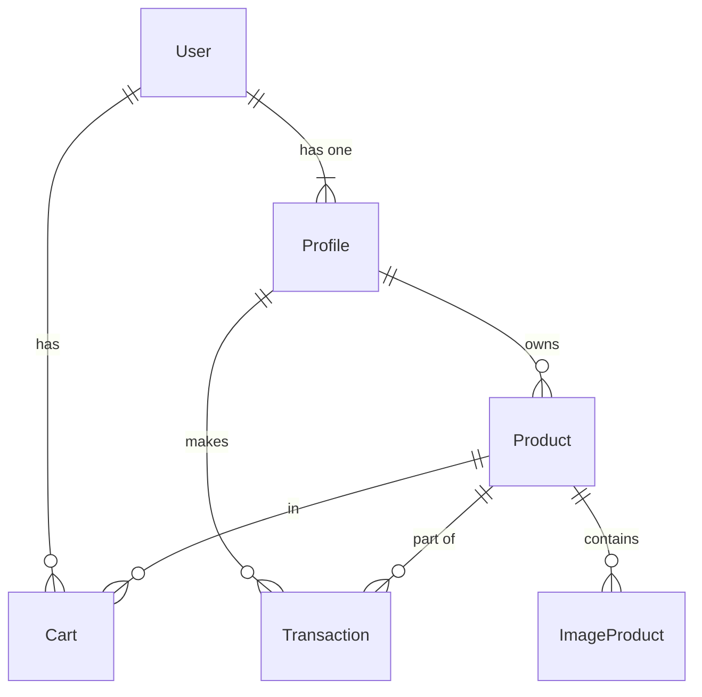

# Database Schema

The database relies on **PostgreSQL** managed via **Prisma ORM**.

## Entity Relationship Diagram (ERD)

## Models

### User
| Field | Type | Attributes | Description |
| :--- | :--- | :--- | :--- |
| `id` | Int | PK, AutoInc | Unique ID |
| `email` | String | Unique | User email |
| `password` | String | | Hashed password |
| `role` | Enum | Default(USER) | ADMIN or USER |

### Profile
| Field | Type | Attributes | Description |
| :--- | :--- | :--- | :--- |
| `id` | Int | PK, AutoInc | Unique ID |
| `userId` | Int | FK, Unique | Linked User |
| `name` | String | Unique | Full name |
| `address` | String? | | Shipping address |
| `phone` | String? | | Contact number |

### Product
| Field | Type | Attributes | Description |
| :--- | :--- | :--- | :--- |
| `id` | Int | PK, AutoInc | Unique ID |
| `name` | String | | Product name |
| `price` | String | | Price value |
| `quantity` | Int | | Stock available |

### Transaction
| Field | Type | Attributes | Description |
| :--- | :--- | :--- | :--- |
| `id` | Int | PK, AutoInc | Unique ID |
| `status_code` | String | | Payment status code |
| `transaction_status` | String | | e.g. settlement, pending |
| `gross_amount` | String | | Total paid |
